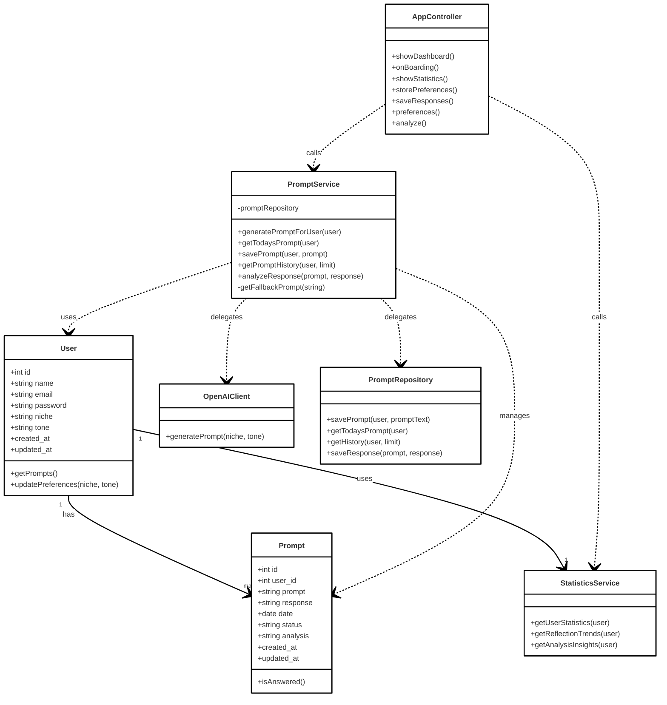
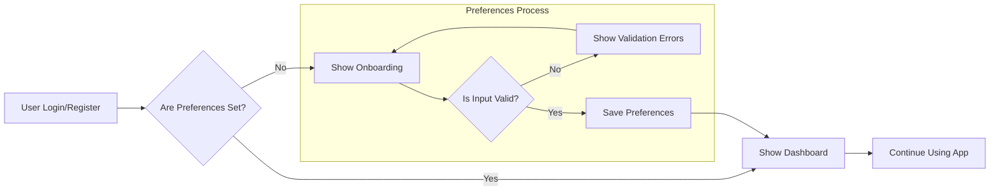

# 📝 InspireDay

An AI-powered journaling web app that helps users build a daily reflection habit with personalized prompts, intelligent insights, and progress tracking.


## About

InspireDay is a modern reflection platform designed to make journaling effortless and insightful. Users receive AI-generated prompts tailored to their interests and preferred tone.

After writing their reflection, they can get AI-powered analysis with actionable feedback to deepen self-awareness and personal growth.

## 📦 Technologies

**Frontend:**
- `React.js 19` with TypeScript
- `Inertia.js` - SPA experience with SSR benefits
- `Tailwind CSS 4.0` - Modern utility-first styling
- `Radix UI` - Accessible component primitives
- `Tiptap` - Rich text editor for reflections
- `Framer Motion` - Smooth animations
- `Vite` - Fast build tooling

**Backend:**
- `Laravel 11` - PHP framework with clean architecture
- `Laravel Sanctum` - API authentication  
- `SQLite/MySQL` - Database options
- `Service Architecture` - Clean separation of concerns

**AI Service:**
- `Python FastAPI` - High-performance async API
- `OpenAI GPT-3.5` - Prompt generation and analysis
- `Docker` - Containerized deployment

## ✨ Features

**Personalized Daily Prompts**: Get AI-generated reflection questions tailored to your niche and tone preferences.

**Smart Rich Text Editor**: Write reflections with a powerful editor featuring formatting and distraction-free writing.

**AI-Powered Analysis**: Receive insightful feedback on your reflections with positive reinforcement and growth suggestions.

**Progress Tracking**: View comprehensive statistics including reflection streaks, word counts, and habit consistency.

**Reflection History**: Browse, search, and revisit past reflections with an organized timeline view.

**Responsive Design**: Seamlessly switch between desktop and mobile with a fully responsive interface.

### 🎯 Key User Flows

**Daily Reflection Journey:**
Get your personalized prompt, write and reflect using the rich text editor, get optional AI insights, and track your progress.

**Onboarding Experience:**
Sign up with email verification, set reflection preferences, write your first reflection, and explore the features.

## 👩🏽‍🍳 The Process

The goal of InspireDay is to inspire consistent daily journaling habits that benefit mental health and wellbeing. By providing personalized daily prompts, it eliminates writer's block and makes reflection effortless.

The AI-powered analytics then help users upgrade their journaling skills by tracking progress, identifying patterns, and offering insights for deeper self-awareness. While not intended to replace therapy, it draws inspiration from how people use AI for psychological support, channeling that into structured daily reflection that contributes to motivation and mental clarity.

I began by creating a UML class diagram to establish a solid architectural foundation for the backend. This is a single feature that could be expanded in a larger SaaS.

After finalizing the backend, I moved on to the frontend, connecting everything together with a soothing, positive theme. Initially, I implemented a simple text area for journaling, but it felt too basic.

I expanded it further by integrating a rich text editor to enhance the user experience. To complete the app's functionality, I added an analytics endpoint alongside the existing generate (prompt) endpoint, creating a full-circle experience for users.

This allows them to not only reflect but also gain insights into their journaling habits and progress. Overall, this project demonstrates modern full-stack development with AI integration, microservices architecture, Docker containerization, and comprehensive CI/CD pipelines.

It showcases the complete development lifecycle from backend services to frontend components, all while maintaining clean code practices and scalable architecture.

## 📚 What I Learned

### 🧠 Full-Stack Architecture

**Service-Oriented Design**: Implemented clean separation between Laravel services and repositories for maintainable, testable code.

**Microservices Integration**: Built reliable communication between Laravel and Python services with proper error handling.

### 🎨 Modern Frontend Development

**Component Architecture**: Built reusable, composable components with Radix UI primitives for accessibility.

**State Management**: Effectively used React hooks for local state and Inertia for server state synchronization.

### 🤖 AI Integration

**OpenAI API**: Implemented prompt engineering for consistent, relevant question generation and analysis.

**Error Handling**: Built robust fallback systems for AI service outages or failures.

### 🚀 Challenges and Solutions

**AI Service Consistency**: Ensuring reliable AI responses was challenging but led to better prompt engineering skills.

**Initial Design Planning**: Thorough upfront planning created a smooth development process and easy feature expansion.

## 💭 Future Improvements

**Enhanced Analytics**: Add data visualizations with charts for reflection trends and sentiment analysis.

**Social Features**: Community aspects like shared prompts and reflection groups.

**Mobile App**: Native iOS/Android apps with offline writing and push notifications.

**Advanced AI**: Implement mood tracking, sentiment analysis, and personalized coaching.

**Export & Sharing**: PDF exports, weekly summaries, and social media sharing.

## 🚦 Running the Project

### Quick Start with Docker

1. **Prerequisites**: Ensure Docker and Docker Compose are installed.

2. **Clone and Setup**:
   ```bash
   git clone <repository-url>
   cd inspireDay-app
   make setup-ci # copies all the .env.examples to .env
   ```

3. **Configure Environment**:
    Open the `.env` file in the `/ai` directory and add your OpenAI API key.
    Generate a unique `APP_KEY` by running:
     ```bash
     php artisan key:generate
     ```
    Add the generated `APP_KEY` to both `.env` and `/web/.env` files.
1. **Launch the Application**:
   ```bash
   make up
   ```

2. **Access the App**: Visit [http://localhost:80](http://localhost:80).

## 🔧 Architecture


The app follows a clean **Repository Pattern** with service layer separation:



## 📊 User Onboarding Flow



## 🍿 Demo

*Video demo and screenshots coming soon*
