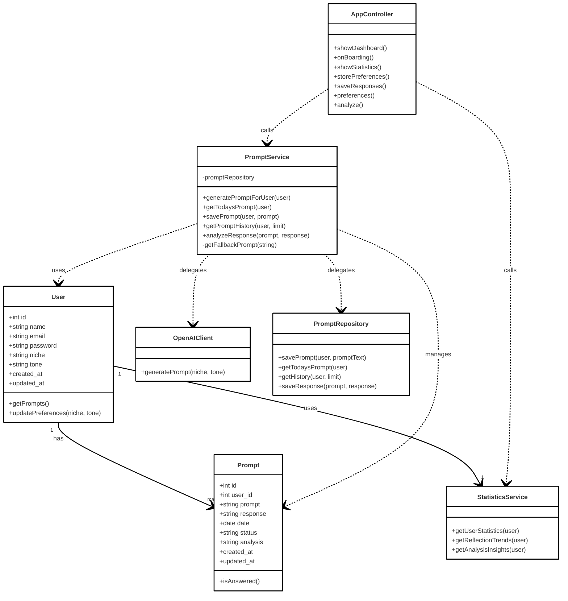
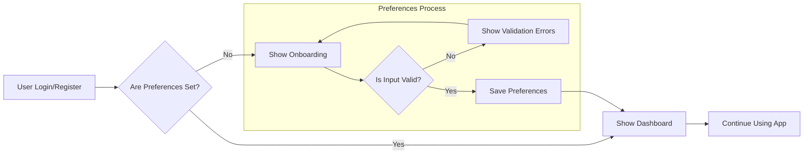

# 📝 InspireDay

An AI-powered journaling web app that helps users build a daily reflection habit with personalized prompts, intelligent insights, and progress tracking. Built with Laravel, React, and a Python microservice for AI integration.

## About

InspireDay is a modern reflection platform designed to make journaling effortless and insightful. Users receive AI-generated prompts tailored to their interests (business, creativity, wellness, personal growth) and preferred tone (casual, professional, reflective, inspiring). After writing their reflection, they can get AI-powered analysis with actionable feedback to deepen their self-awareness and personal growth.

## 📦 Technologies

**Frontend:**
- `React.js 19` with TypeScript
- `Inertia.js` - SPA experience with SSR benefits
- `Tailwind CSS 4.0` - Modern utility-first styling
- `Radix UI` - Accessible component primitives
- `Tiptap` - Rich text editor for reflections
- `Framer Motion` - Smooth animations
- `Vite` - Fast build tooling

**Backend:**
- `Laravel 11` - PHP framework with clean architecture
- `Laravel Sanctum` - API authentication
- `SQLite/MySQL` - Database options
- `Service Architecture` - Clean separation of concerns

**AI Service:**
- `Python FastAPI` - High-performance async API
- `OpenAI GPT-3.5` - Prompt generation and analysis
- `Docker` - Containerized deployment

## 🦄 Features

Here's what you can do with InspireDay:

- **Personalized Daily Prompts**: Get AI-generated reflection questions tailored to your niche (Business, Creativity, Wellness, Personal Growth) and tone preferences
  
- **Smart Rich Text Editor**: Write reflections with a powerful editor featuring formatting, lists, links, and a distraction-free writing experience
  
- **AI-Powered Analysis**: Receive insightful feedback on your reflections with positive reinforcement and constructive suggestions for growth
  
- **Progress Tracking**: View comprehensive statistics including reflection streaks, word counts, monthly trends, and habit consistency
  
- **Reflection History**: Browse, search, and revisit past reflections with an organized timeline view
  
- **Responsive Design**: Seamlessly switch between desktop and mobile with a fully responsive interface
  
- **Secure Authentication**: Complete auth system with email verification and password management
  
- **Customizable Preferences**: Adjust reflection topics, tone, profile settings, and account preferences in an organized tabbed interface

### 🎯 Key User Flows

**Daily Reflection Journey:**
1. **Get Your Prompt**: Receive a personalized daily question based on your preferences
2. **Write & Reflect**: Use the rich text editor to capture your thoughts and insights
3. **Get AI Insights**: Optional analysis provides feedback to deepen your reflection
4. **Track Progress**: View your growing collection of reflections and progress metrics

**Onboarding Experience:**
1. **Sign Up**: Create account with email verification
2. **Set Preferences**: Choose your reflection niche and preferred tone
3. **First Reflection**: Get started with your personalized daily prompt
4. **Explore Features**: Discover statistics, history, and AI analysis

## 👩🏽‍🍳 The Process

The goal of InspireDay is to inspire consistent daily journaling habits that benefit mental health and wellbeing. By providing personalized daily prompts, it eliminates writer's block and makes reflection effortless. The AI-powered analytics then help users upgrade their journaling skills by tracking progress, identifying patterns, and offering insights for deeper self-awareness. While not intended to replace therapy, it draws inspiration from how people use AI for psychological support, channeling that into structured daily reflection that contributes to motivation and mental clarity.

I began by creating a UML class diagram to establish a solid architectural foundation for the backend. This is a single feature that could be expanded in a larger SaaS. After finalizing the backend, I moved on to the frontend, connecting everything together with a soothing, positive theme. Initially, I implemented a simple text area for journaling, but it felt too basic. I expanded it further by integrating a rich text editor to enhance the user experience.

To complete the app's functionality, I added an analytics endpoint alongside the existing generate (prompt) endpoint, creating a full-circle experience for users. This allows them to not only reflect but also gain insights into their journaling habits and progress.

**Architecture Decisions:**
I chose a microservices approach with Laravel handling the web app and a separate Python service for AI operations. This allows independent scaling, easier testing, and separation of concerns between business logic and AI processing.

**Frontend Philosophy:**
Using Inertia.js bridges Laravel and React perfectly, providing SPA responsiveness while maintaining server-side rendering benefits. I built reusable UI components with Radix primitives and Tailwind for consistency and accessibility.

**AI Integration:**
The Python FastAPI service handles OpenAI interactions with proper error handling, logging, and fallbacks. Prompts are generated based on user preferences, and analysis provides structured feedback with both positive reinforcement and growth suggestions.

**User Experience Focus:**
Every interaction is designed to be frictionless - from the onboarding flow that captures preferences to the one-click AI analysis. The statistics page gamifies the experience with streak tracking and trend visualization to maintain motivation.

## 📚 What I Learned

During this project, I gained deep experience in several key areas:

### 🧠 Full-Stack Architecture

- **Service-Oriented Design**: Implemented clean separation between Laravel services (PromptService, StatisticsService) and repositories for maintainable, testable code
- **Microservices Integration**: Built reliable communication between Laravel and Python services with proper error handling and fallbacks
- **API Design**: Created RESTful endpoints with proper validation, error responses, and consistent data structures

### 🎨 Modern Frontend Development

- **Component Architecture**: Built reusable, composable components with Radix UI primitives for accessibility and modularity.
- **Storybook Integration**: Used Storybook to document and test components in isolation, ensuring consistency and improving the development workflow.
- **Atomic Design Principles**: Applied atomic design principles to structure components, focusing on modularity and reusability, even for smaller-scale use cases.
- **State Management**: Effectively used React hooks for local state and Inertia for server state synchronization.
- **Rich Text Editing**: Integrated Tiptap for a powerful, customizable writing experience.
- 
### 🤖 AI Integration

- **OpenAI API**: Implemented prompt engineering for consistent, relevant question generation and analysis
- **Error Handling**: Built robust fallback systems for AI service outages or failures
- **Async Processing**: Used FastAPI for high-performance async AI operations

### 🔧 Development Workflow

- **Testing Strategy**: Implemented unit tests for services and components with Jest and Vitest
- **Docker Containerization**: Created reproducible development and deployment environments
- **Code Quality**: Set up ESLint, Prettier, and TypeScript for consistent code standards

### 🚀 Challenges and Lessons Learned

- **AI Service Consistency**: One of the most challenging aspects of this project was ensuring consistent and useful responses from the AI service. I learned to craft concise and precise instructions for the AI, which significantly improved its behavior and made the responses more reliable which will help me in building future AI features.

- **Initial Design Planning**: The initial design phase was another challenging yet rewarding part of the project. By thoroughly planning the architecture and design upfront, I created a smooth development process. This planning provided a clear fallback and made it easier to expand the app further as new features were added.

## 💭 How can it be improved?

- **Enhanced Analytics**: Add data visualizations with charts for reflection trends, sentiment analysis over time, and word cloud generation
- **Social Features**: Community aspects like shared prompts, reflection groups, and mentor connections
- **Mobile App**: Native iOS/Android apps with offline writing capabilities and push notifications
- **Advanced AI**: Implement mood tracking, sentiment analysis, goal-setting assistance, and personalized coaching
- **Export & Sharing**: PDF exports, weekly summaries, social media sharing, and integration with note-taking apps
- **Gamification**: Achievement system, reflection challenges, and community leaderboards
- **Collaboration**: Shared family/team journals, reflection partnerships, and guided group sessions

## 🚦 Running the Project

### Quick Start with Docker (Recommended)

1. **Prerequisites**: Docker and Docker Compose installed
2. **Clone and setup**:
   ```bash
   git clone <repository-url>
   cd inspireDay-app
   cp .env.example .env
   ```
3. **Configure environment**: Edit `.env` within the ai-service your own OpenAI API key and other settings
4. **Launch stack**:
   ```bash
   make up
   ```
5. **Visit**: http://localhost:8000

## 🔧 Architecture


The app follows a clean **Repository Pattern** with service layer separation:



## 📊 User Onboarding Flow



## 🍿 Demo

*Video demo and screenshots coming soon*
