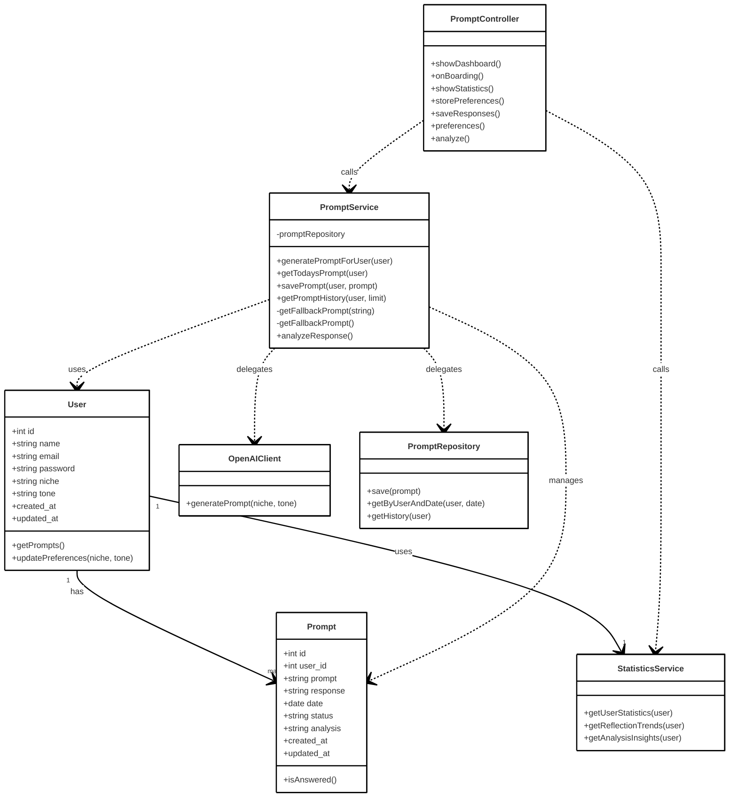

```mermaid
---
config:
  theme: neo
---
classDiagram
    class User {
        +int id
        +string name
        +string email
        +string password
        +string niche
        +string tone
        +created_at
        +updated_at
        +getPrompts()
        +updatePreferences(niche, tone)
    }
    class Prompt {
        +int id
        +int user_id
        +string prompt
        +string response
        +date date
        +string status
        +string analysis
        +created_at
        +updated_at
        +isAnswered()
    }
    class OpenAIClient {
        +generatePrompt(niche, tone)
    }
    class PromptRepository {
        +save(prompt)
        +getByUserAndDate(user, date)
        +getHistory(user)
    }
    class PromptService {
        +generatePromptForUser(user)
        +getTodaysPrompt(user)
        +savePrompt(user, prompt)
        +getPromptHistory(user, limit)
        -getFallbackPrompt(string)
        -getFallbackPrompt()
        +analyzeResponse()
        -promptRepository
    }
    class StatisticsService {
        +getUserStatistics(user)
        +getReflectionTrends(user)
        +getAnalysisInsights(user)
    }
    class PromptController {
        +showDashboard()
        +onBoarding()
        +showStatistics()
        +storePreferences()
        +saveResponses()
        +preferences()
        +analyze()
    }
    User "1" --> "many" Prompt : has
    User "1" --> "1" StatisticsService : uses
    PromptService ..> User : uses
    PromptService ..> Prompt : manages
    PromptService ..> OpenAIClient : delegates
    PromptService ..> PromptRepository : delegates
    PromptController ..> PromptService : calls
    PromptController ..> StatisticsService : calls
```