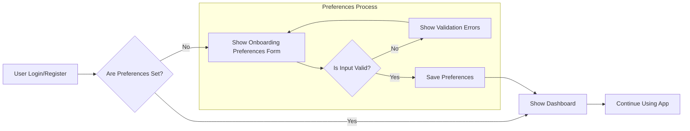

<!-- filepath: [user-onboarding-flow.md](http://_vscodecontentref_/0) -->

```mermaid
graph LR
    Start[User Login/Register] --> CheckPreferences{Are Preferences Set?}
    CheckPreferences -->|Yes| Dashboard[Show Dashboard]
    CheckPreferences -->|No| OnboardingPreferencesForm[Show Onboarding Preferences Form]
    
    subgraph PreferencesProcess [Preferences Process]
        OnboardingPreferencesForm --> ValidateInput{Is Input Valid?}
        ValidateInput -->|No| ShowErrors[Show Validation Errors]
        ShowErrors --> OnboardingPreferencesForm
        ValidateInput -->|Yes| SavePreferences[Save Preferences]
    end

    SavePreferences --> Dashboard
    Dashboard --> End[Continue Using App]
```